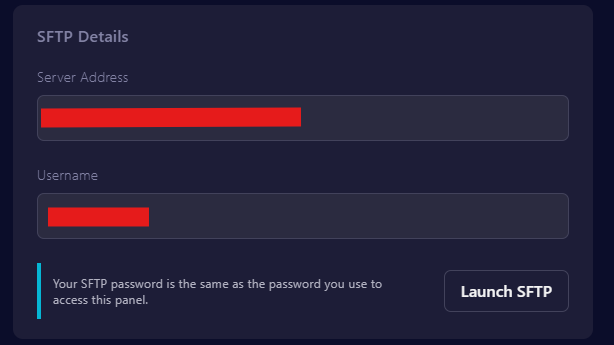
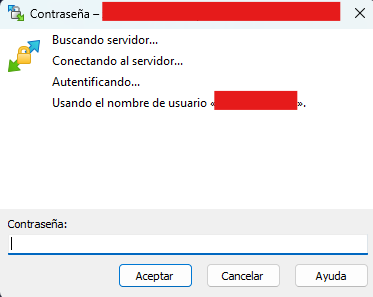

# 💡 Preparando el servidor


**ALERTA** **:** recordá que **CS2** esta en desarrollo continuo lo que hace que algunos plugins dejen de funcionar tras cada actualización.


## Que necesito para instalar plugins en mi servidor?

Para instalar plugins en mi servidor de CS2 es necesario tener : \
\-> [<mark style="color:red;">METAMOD DEV (2X)</mark>](https://mms.alliedmods.net/mmsdrop/2.0/mmsource-2.0.0-git1313-linux.tar.gz) <mark style="color:purple;">( VERSION DE LINUX)</mark> <- CLICK PARA DESCARGAR

\-> [<mark style="color:red;">CounterStrikeSharp</mark>](https://github.com/roflmuffin/CounterStrikeSharp/releases) <mark style="color:purple;">(VERSIONES CON RUNTIME DE LINUX)</mark> <- CLICK PARA REDIRIGIRTE&#x20;

\-> [<mark style="color:red;">WINSCP</mark>](https://cdn.winscp.net/files/WinSCP-6.3.4-Setup.exe?secure=ujH18XPyOgd0kaw0BW7slQ==,1725371758) <mark style="color:purple;">(PARA CONECTAR AL SERVIDOR MEDIANTE SFTP)</mark> <- CLICK PARA DESCARGAR&#x20;


## Como conecto a mi servidor mediante SFTP?&#x20;

Una vez instalado WinSCP, nos dirigimos a nuestro servidor en: [https://pterodactyl.histeriaservers.com.ar/](https://pterodactyl.histeriaservers.com.ar/), buscamos el servidor deseado (en caso de tener varios) y hacemos clic en "Manage Server".\
Luego, nos dirigimos a "Settings" y hacemos clic en "Launch SFTP"

<figure><figcaption></figcaption></figure>

Automáticamente se nos abrirá una ventana de WinSCP en la que debemos usar la contraseña de nuestro panel.

<figure><figcaption></figcaption></figure>

Después de esto, se nos mostrarán todos los archivos de nuestro servidor, permitiéndonos comenzar a modificarlos.


Estos pasos no se pueden evitar.


## Instalando Metamod

* Extrae Metamod y subi la carpeta <mark style="color:purple;">**addons**</mark> a /game/csgo/.
* Dentro de /game/csgo/, localiza el archivo <mark style="color:purple;">gameinfo.gi</mark>.
* Crea una nueva línea debajo de <mark style="color:purple;">Game\_LowViolence csgo\_lv</mark> y añade <mark style="color:purple;">Game csgo/addons/metamod</mark>.
* &#x20;Reinicia tu servidor.
* Comproba el funcionamiento usando <mark style="color:purple;">**meta list**</mark> en la consola web de tu servidor.

[gameinfo.gi ejemplo](https://docs.cssharp.dev/images/gameinfogi-example.png)


## Instalando CounterStrikeSharp

Extrae CounterStrikeSharp y copia el directorio /addons/ a /game/csgo/.\
Reinicia tu servidor de juego.\
Ejecutar el comando `meta list` en la consola debería mostrar 1 plugin cargado. 🎉

```
meta list
Listing 1 plugin:
  [01] CounterStrikeSharp (v253 @ 5644921) by Roflmuffin
```

